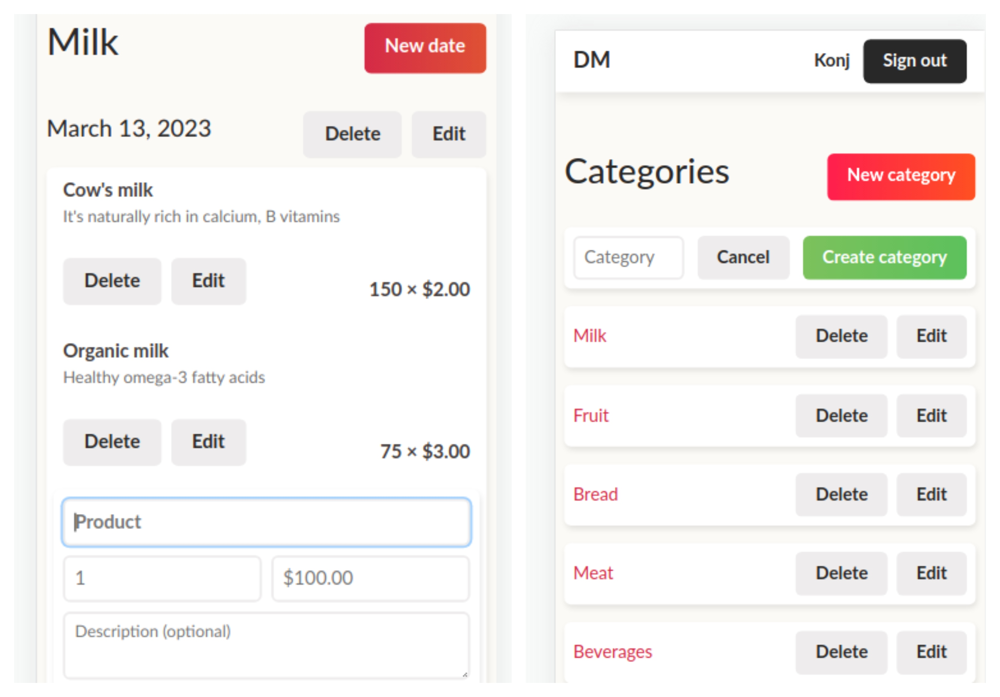

# Inventory management

<!-- PROJECT LOGO -->
<div align="center">
  <a href="https://github.com/DeVuDeveloper/rails-hotwire">
    
  </a>

  <h1 align="center">Inventory management</h1>

  <p align="center">
   
  <a href="https://github.com/DeVuDeveloper/rails-hotwire.git.#readme"><strong>Explore the docs*»</strong></a>
    <br />
    <br />
    ·
    <a href="https://github.com/DeVuDeveloper/rails-hotwire.git./issues/1">Report Bug</a>
    ·
    <a href="https://github.com/DeVuDeveloper/rails-hotwire.git./issues/1">Request Feature</a>
  </p>
</div>

## Diagram

## 


## Description 🏗️
Inventory managenet is a very useful application for storing your inventory.
The application was built with Ruby on rails and Hotwire. All links are intercepted with turbo rails and the user can add and edit inventory on the same page where the inventory is located thanks to the magic of hotwire.
The user can add an inventory category and add products for a specific category on specific dates. The total value of all products for a specific date for a specific category is also added.
The software is great for accountants.

<p align="right">(<a href="#top">back to top</a>)</p>

## Live Demo

([Live preview]())

## Getting Started 🏁

### Prerequisites and Dependencies 📜

You will be needing:

- A terminal terminal
- A code editor
- Ruby (follow the instructions based on your OS)
  ```bash
  https://www.ruby-lang.org/en/documentation/installation/
  ```
- Rails (follow the instructions based on your OS)

  ```bash
  https://guides.rubyonrails.org/getting_started.html#creating-a-new-rails-project-installing-rails
  ```

- Postgresql (follow the instructions based on your OS)
  ```bash
  https://www.postgresql.org/download/
  ```

### Clone this repository

```bash
git clone https://github.com/DeVuDeveloper/rails-hotwire.git
```

### Move into the cloned directory with

```bash
cd rails-hotwire

```

## Setup

Install gems with:

```bash
bin/rails/setup
```

seed the database with:

```bash
bin/rails db:seed
```

### Run linter

```bash
rubocop .
```

#### Auto-correct

In auto-correct mode, RuboCop linters offenses will be automatically fixed:

For rubocop:

```bash
rubocop -A
```

**<div>OR</div>**

```bash
rubocop --auto-correct-all
```

### Run Project

Start server with:

```bash
bin/dev
```

<div align="center">OR</div>

```bash
rails server -p 3000
```

This will start a server at:

```bash
localhost:3000
```

You can paste or type it on url bar

<p align="right">(<a href="#top">back to top</a>)</p>

<!-- ROADMAP -->

### Roadmap

- [x] Set up the repository/repositories on GitHub and use Gitflow.
- [x] Create new rails app
- [x] A simple CRUD controller with Rails
- [x] Turbo Drive
- [x] Turbo Frames and Turbo Stream templates
- [x] Turbo Streams and security
- [x] Flash messages with Hotwire
- [x] Two ways to handle empty states with Hotwire
- [x] Another CRUD controller with Turbo Rails
- [x] Adding a category total with Turbo Frames
- [x] Create README

<p align="right">(<a href="#top">back to top</a>)</p>

## Built With 🔨

<div align="center">

|     | Languages                                                                                                                                                                                                                                                                                                                  |     |
| --- | -------------------------------------------------------------------------------------------------------------------------------------------------------------------------------------------------------------------------------------------------------------------------------------------------------------------------- | --- |
|     |  |

<div align="center">


|     | Tools 🛠️                                                                                                                                                                                                                                                                                                                                                                                                                                                                              |     |
| --- | ------------------------------------------------------------------------------------------------------------------------------------------------------------------------------------------------------------------------------------------------------------------------------------------------------------------------------------------------------------------------------------------------------------------------------------------------------------------------------------- | --- |
|     |     |     |

<p align="right">(<a href="#top">back to top</a>)</p>
</div>

## Authors ✍️

<div align="center">

| 👤 DeVuDeveloper|
| -------- |

| <a target="_blank" href="https://github.com/DeVuDeveloper"></a> <a target="_blank" href="https://www.linkedin.com/in/devuj/"></a> <a target="_blank" href="https://twitter.com/DejanVuj"></a>
|

</div>

<p align="right">(<a href="#top">back to top</a>)</p>

## 🤝 Contributors

Contributions, issues, and feature requests are greatly appreciated!

If you have a suggestion that would make this better, please fork the repo and create a pull request. You can also simply open an issue with the tag "improvements".

- Fork the Project
- Create your Feature Branch (git checkout -b feature/yourfeaturename)
- Commit your Changes (git commit -m 'Add suggested feature')
- Push to the Branch (git push origin feature/AmazingFeature)
- Open a Pull Request

Feel free to check the [issues page](https://github.com/DeVuDeveloper/rails-hotwire/issues/1).

<p align="right">(<a href="#top">back to top</a>)</p>

## 📝 License

This project is licensed by [](LICENSE)

## Show your support 💪

Give a ⭐️ if you like this project!

<p align="right">(<a href="#top">back to top</a>)</p>